# School_District_Analysis

## Overview of School District Analysis

Our client, Maria, likes the work we have done so far with the school district analysis. However, she has been informed that some of the data was altered, specifically for ninth graders at Thomas High School. Maria needs us to replace all the scores for ninth graders at Thomas High School with NaNs. We then need to repeat our analysis with the changes we made.

### Purpose

The purpose of this school district analysis is to create data frames that show how well each school performed with the updated scores for Thomas High School ninth graders. 

## School-District Analysis Results

* The school district summary has changed slightly with the updated data. The first image below shows the old data frame, and the second image shows the new, updated data frame. The new average math score for the whole district went from 79.0% to 78.9%. The average reading score stayed the same, at 81.9%. The percentages of students that passed math and reading both dropped slightly. The overall percentage of students that passed math and reading went from 65.2% to 64.9%.

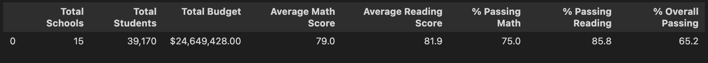

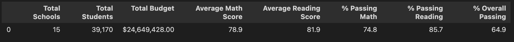

* The school summary has changed drastically for Thomas High School, with our updated data. The old summary shows that The percentage of students that passed math went from 66.9% to 93.2%, the percentage of students that passed reading went from 69.7% to 97.0%, and the percentage of students that passed both math and reading went from 65.1% to 90.7%. Th first image below shows the old school summary, and the second image shows the new school summary.

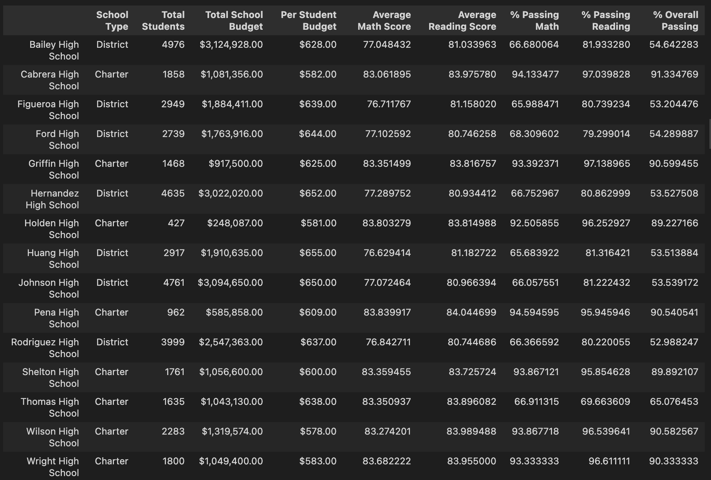

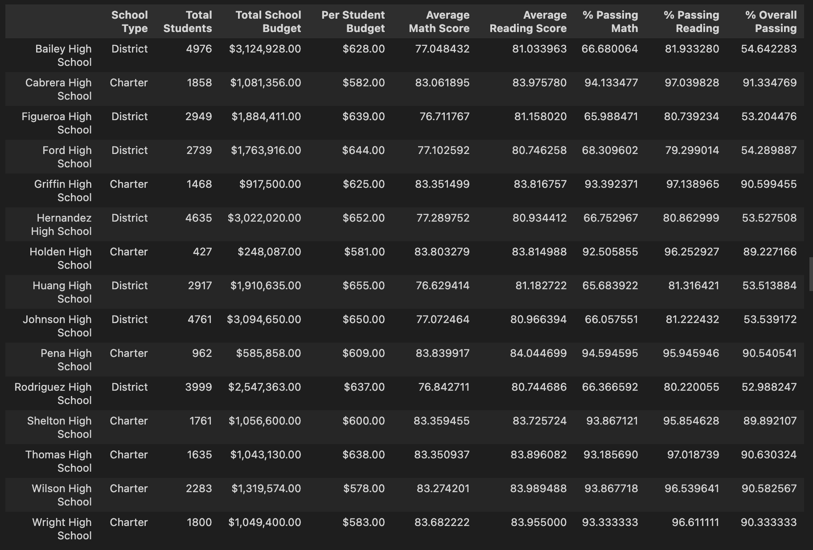

* The top schools (based on the percentage of students who passed both reading and math) can be seen below.Replacing all the ninth graders' math and reading scores for Thomas High School increased the percentage of passing students from 65.1% to 90.7%. The new percentage is enough to put Thomas High School in the top 5 schools, at number 2.

* We only changed the math and reading scores for ninth graders at Thomas High School. Since this is only a small part of the total data, it only slightly affects the spending, size, and type summaries. I added images of unformatted dataframes to show the small changes.

    * The first image below shows the math scores for every school and grade, and the second image shows the reading scores. We changed the math and reading scores for ninth graders at Thomas High School, and made them all NaN. 

    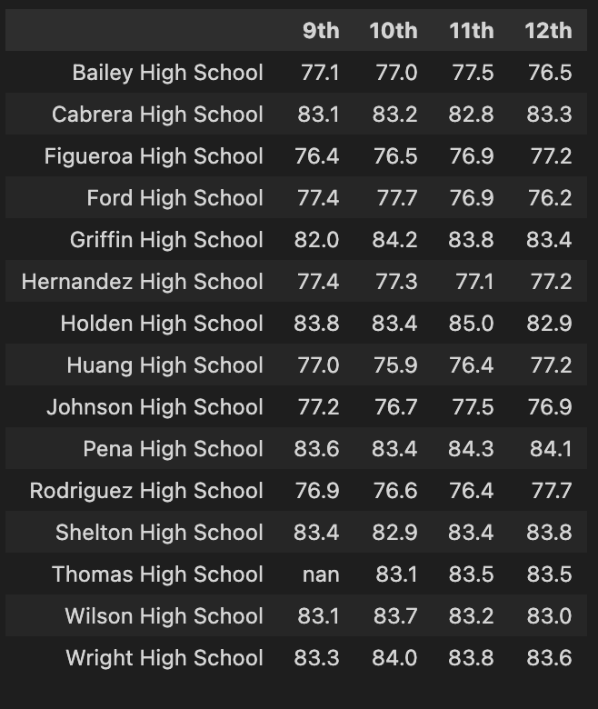

    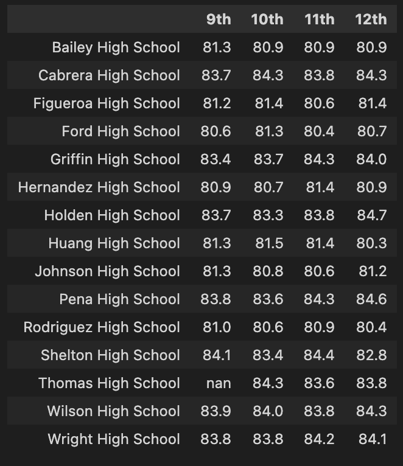

    * We only changed the scores for ninth graders at Thomas High School. THS is in the $630-$644 spending range. The numbers only changed slightly. The second image below displays our new data.

    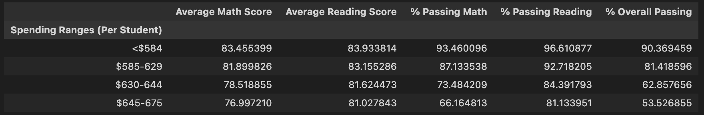

    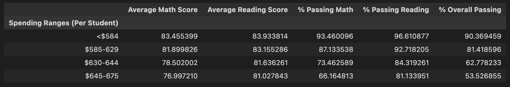

    * Thomas High School is a medium sized school (1000-2000 students). The numbers for medium sized schools barely changed. The second image below shows our new numbers.

    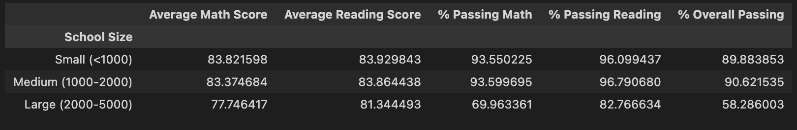

    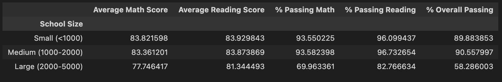

    * Thomas High School is a charter school, and the numbers for charter schools changed only a little bit. The second image shows new data.

    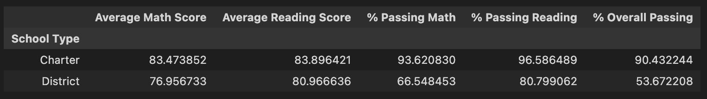

    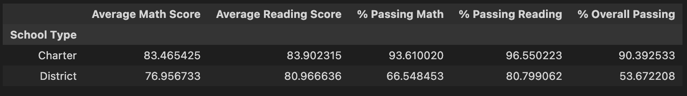

## School District Analysis Summary

We changed all the math and reading scores for ninth graders at Thomas High School to be NaN. We observed many changes in our updated analysis. The first change we noticed was that the overall percentage of students that passed in the whole district dropped from 65.2 to 64.9. The second change we saw was that the percentage of students that passed math, reading, and both math and reading greatly increased for Thomas High School. These updated percentages led THS to be in the top 5 schools, at number 2, which was the third change we noticed. The last thing we observed based on our updated data was that the data frames based on school spending, size, and type did not change significantly. 